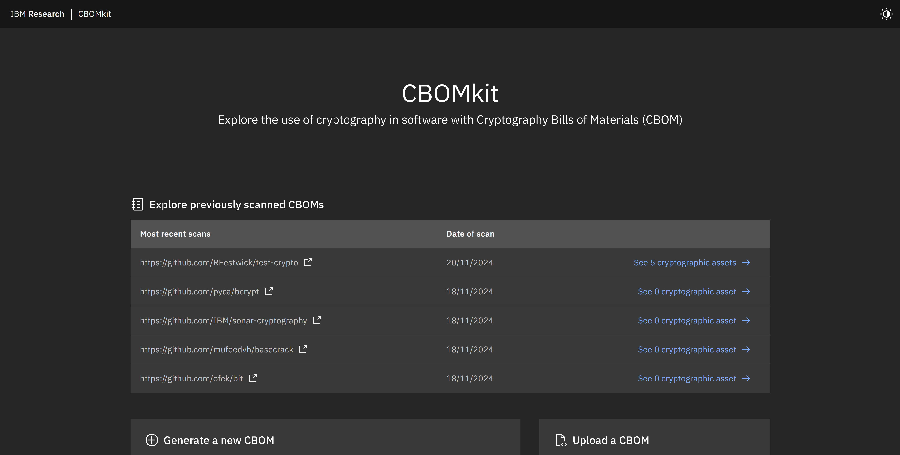
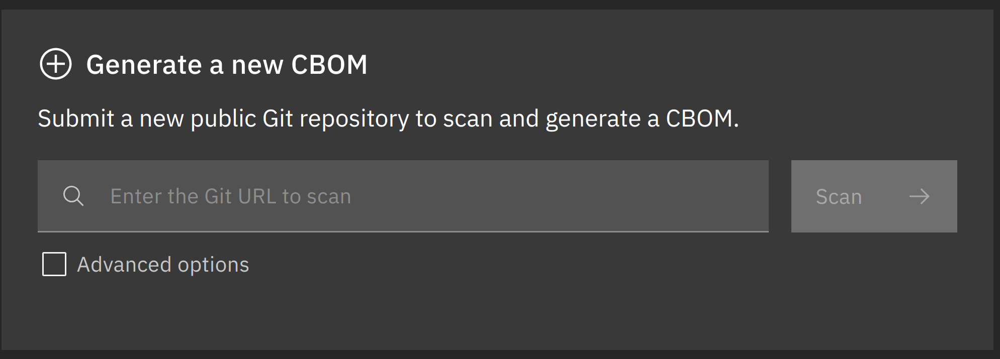
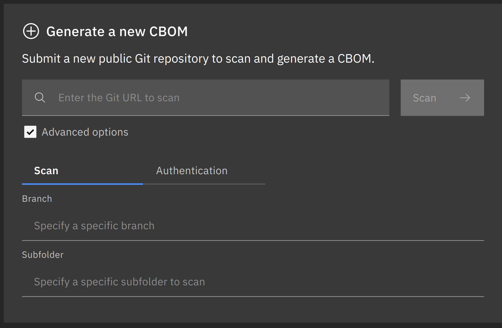
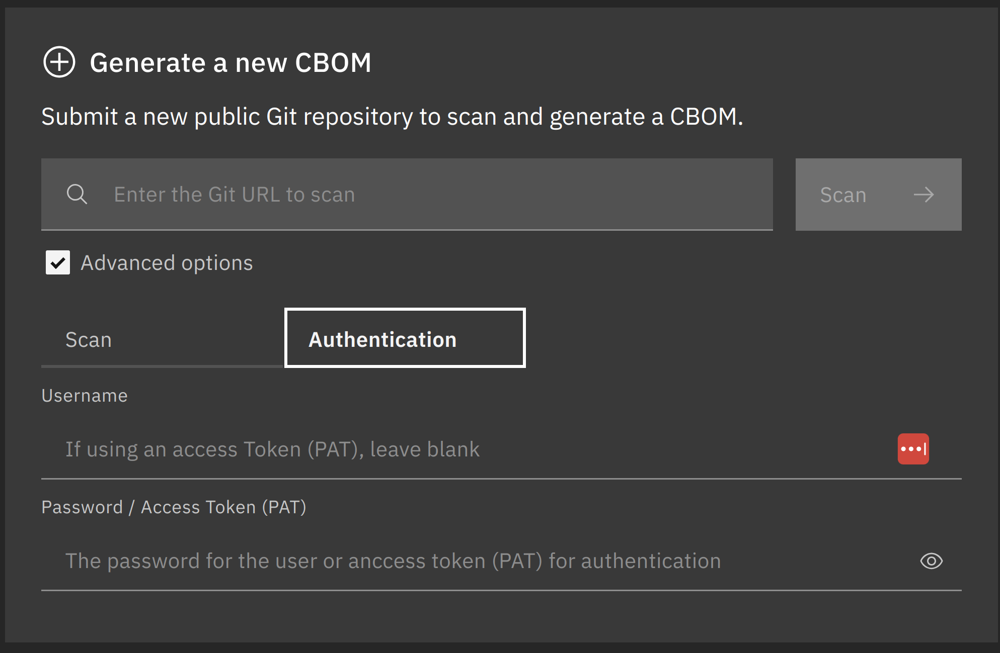
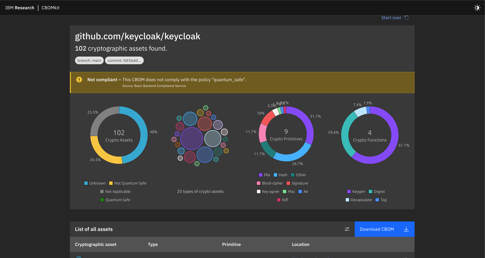

# Creating CBOMs Using the IBM Cbomkit Application

## Introduction

This tutorial illustrates how to create a cryptography bill of materials (CBOM) from git projects using the IBM CBOMkit application.

## Requirements

* git
* docker-compose

## Installation

Install CBOMkit by cloning its repository by running the following:

```bash
git clone https://github.com/IBM/cbomkit
```

Navigate and initiate the application by running:

```bash
cd cbomkit
make production
```

Navigate to http://localhost:8001 on your browser. You should see a page akin to the following:



## Usage

To create a CBOM, navigate to the "Generate a new CBOM" section:



Then, paste the URL of the git repo in question. Then, click "Scan".

Advanced settings are accessed via clicking the "Advanced options" checkbox. The advanced options are:

* Scan: Where specific branches and folders can be specified.
    
    

* Authentication: Where repo authentication can be specified via username and password or through a personal access token (PAT).
    
    

After the scan is completed, the output will look similar to the following:



To download the created CBOM, navigate to the "Download CBOM" button on the right hand side and click on it:


The generated ```cbom.json``` file will be downloaded to your system's default downloads folder.
## Notes

* The requirement ```docker-compose``` is separate to the subcommand, ```docker compose```. 

## SBOM

<html lang="en">
<head>
    <meta charset="UTF-8">
    <meta name="viewport" content="width=device-width, initial-scale=1.0">
    <title>Pretty JSON Display</title>
    <style>
        #json-container {
            height: 400px; /* Set a fixed height */
            overflow-y: auto; /* Enable vertical scrolling */
            border: 2px solid #ccc; /* Optional: add a border for visibility */
            padding: 10px;
        }
        #xml-container {
            height: 400px; /* Set a fixed height */
            overflow-y: auto; /* Enable vertical scrolling */
            border: 2px solid #ccc; /* Optional: add a border for visibility */
            padding: 10px;
        }
        pre {
            margin: 0;
            white-space: pre-wrap;
            word-wrap: break-word;
        }
    </style>
</head>
<body>
    <h3>
        <a href="./cbom.json">keycloak</a>
    </h3>
    <div id="json-container">
        <pre id="json-display"></pre>
    </div>
    <script>
        function display_json(url, elementid){
        fetch(url)
            .then(response => response.json())
            .then(data => {
                document.getElementById(elementid).textContent = JSON.stringify(data, null, 2);
            })
            .catch(error => console.error('Error fetching JSON:', error));
        }
        function display_xml(url, elementid){
        fetch(url)
            .then(response => response.text())
            .then(data => {
                document.getElementById(elementid).textContent = data;
            })
            .catch(error => console.error('Error fetching XML:', error));
        }
    display_json('./cbom.json', 'json-display');
    </script>
</body>
</html>


## References

* IBM. (2024, November 21). GitHub - IBM/cbomkit: A toolset for dealing with Cryptography Bill of Materials (CBOM). GitHub. [https://github.com/IBM/cbomkit](https://github.com/IBM/cbomkit).